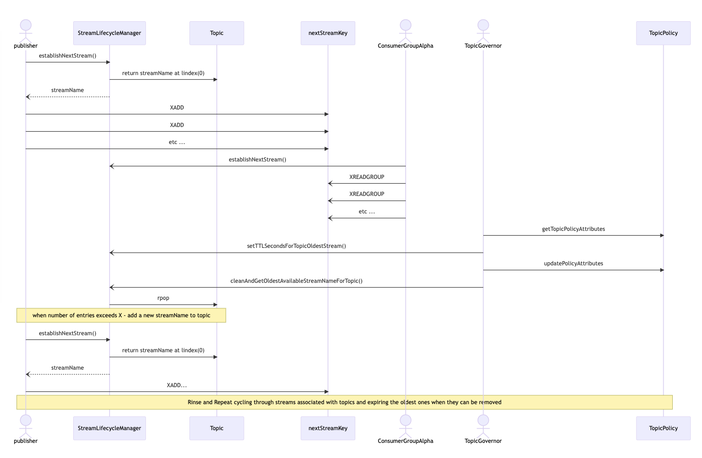
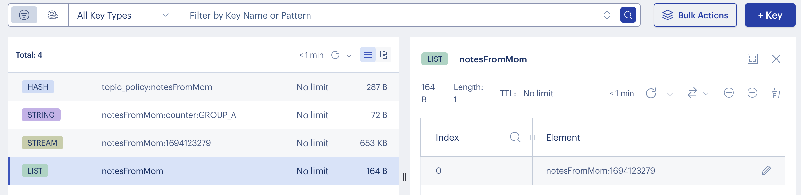
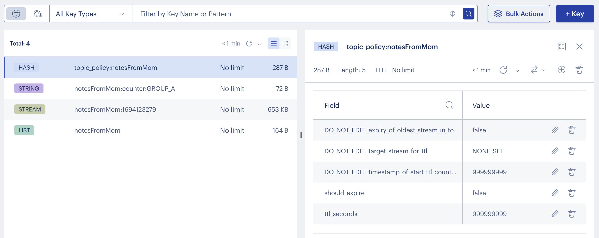
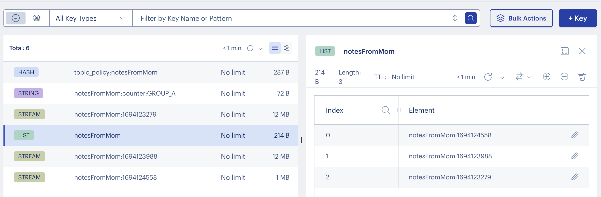

## This program demonstrates writing and processing events using Redis Streams using Jedis 4.3.1

### A bunch has changed this August... I added the concept of a Topic
### Implemented as a List in Redis, it keeps track of all related streams

There are three main versions of this program you can run:
1. Publisher
2. Consumer
3. TopicGovernor

Running each one in a separate shell allows you to clearly see the flow as
publishers move from stream to stream within a topic and consumers do the same
and topicGovernor allows for easy expiration (TTL) configuration and execution 
through the changing of attributes in a TopicPolicy object stored in redis.


#### You can now set up a publisher that writes multiple streams to a topic
These are the arguments that trigger publishing:  
```
--topic someInterestingTopicA --ispublisher true --howmanyentries 10000000 --maxstreamlength 1000000
``` 
#### Workers / ConsumerGroup Members now also use the --topic argument instead of a --streamname
#### The workers now move sequentially from Stream to Stream within a Topic: processing all entries
#### Starting with the oldest Stream

#### - A writer / Publisher writes X events/entries to the streams in a topic
#### - Some number of workers (belonging to a worker group) consume those entries and process them
#### - The processed entries are written to a separate stream ... OR: they are simply counted, and the count is stored in a Redis String
### to get the 'just counted' behavior use:  
--consumerresponseisastream false

#### You may also want to provide the name of the string key used to store the count for this group:
```
--consumerresponseisastream false --resultskeyname topicA:workerGroup2:ResultCount
```

### Example start of a Publisher:
```
mvn compile exec:java -Dexec.cleanupDaemonThreads=false -Dexec.args="--host redis-10400.homelab.local --port 10400 --topic TopicA:{1} --ispublisher true --howmanyentries 1000000 --maxstreamlength 50000 --writerbatchsize 10 --writersleeptime 10 --isconsumer false"
```
### Example start of a Consumer:
```
mvn compile exec:java -Dexec.cleanupDaemonThreads=false -Dexec.args="--host 192.168.1.20 --port 10400 --topic TopicA:{1} --ispublisher false --howmanyworkers 2 --shouldtrimstream false --workersleeptime 10 --streamreadstart 0-0 --resultskeyname consumer:count:TopicA:OT_3 --consumerresponseisastream false  --consumergroupname OT_3"
```

#### This program also has a TopicGovernor mode
#### - running as a TopicGovernor allows setting TTL on the oldest stream in a topic

### Example start of a TopicGovernor:
``` 
mvn compile exec:java -Dexec.cleanupDaemonThreads=false -Dexec.args="--host 192.168.1.20 --port 10400 --topic TopicA:{1} --ispublisher false --isconsumer false --isgovernor true --governorsleepsecs 60"
```

You can run without the
```
--topic <sometopic>
```
argument if you do not want that feature.

The default settings have workers that write results to a second stream and it operates at around 100 ops/second and use:

- A **work to be done** stream name of "X:FOR_PROCESSING{1}"
- A **work completed** stream name of "X:PROCESSED_EVENTS{1}"
- One writer that writes 10000 entries in batches of 200 entries (with 50 millisecond pauses between each batch)
- A worker group of 2 workers that process the entries 1 at a time and sleep 50 milliseconds between each one

* To run the program with the default settings (supplying the host and port for Redis) do:
```
mvn compile exec:java -Dexec.cleanupDaemonThreads=false -Dexec.args="--host 192.168.1.20 --port 10400 --ispublisher true --howmanyentries 10000 --isconsumer true --howmanyworkers 2"
```

* To run the program much, much, much faster you can use the following command:
```
mvn compile exec:java -Dexec.cleanupDaemonThreads=false -Dexec.args="--host 192.168.1.20 --port 10400 --ispublisher true --howmanyentries 10000 --isconsumer true --howmanyworkers 20"
```


The programmatic factors that determine the rate of processing are:
- A) the number of workers in a worker group for each stream
- B) the sleep time given to the workers between entry processing work
- C) the sleep time given to the writers between batches of writes of entries
- D) the batch size of entries given to the writers

To increase and sustain high throughput:
1. build a redis database with 2 shards/partitions so that each shard can have its own stream key
2. run 2 copies of this program providing the following args: (these will be writer instances)

Instance 1:
```  
--streamname X:FOR_PROCESSING{1} --resultsstreamname X:PROCESSED_EVENTS{1} --howmanyentries 200000 --writersleeptime 10 --howmanyworkers 0
```
Instance 2:
```
--streamname X:FOR_PROCESSING{2} --resultsstreamname X:PROCESSED_EVENTS{2} --howmanyentries 200000 --writersleeptime 10 --howmanyworkers 0
```
3. run 2 copies of this program providing the following args: (these will be the worker group instances)

Instance 1:
```
--howmanyworkers 20 --workersleeptime 10 --streamname X:FOR_PROCESSING{1} --resultskeyname X:PROCESSED_EVENTS{1}
```

Instance 2:
```
--howmanyworkers 20 --workersleeptime 10 --streamname X:FOR_PROCESSING{2} --resultskeyname X:PROCESSED_EVENTS{2}
```


### There are a ton of other flags/settings available -check the top of the main method in the class 'Main' to see what other things you can adjust.

## NOTE that the program will not exit on its own if it is running Worker Threads.

Example Run of all three Topic-related Services:

After initial start of the Consumer, Governor and Publisher we see these keys:





Publisher:
``` 
owentaylor@Owens-MacBook-Pro RedisStreamWorkerGroupV2 % mvn compile exec:java -Dexec.cleanupDaemonThreads=false -Dexec.args="--host redis-10400.homelab.local --port 10400 --topic notesFromMom --ispublisher true --howmanyentries 1000000 --maxstreamlength 100000 --writerbatchsize 10 --writersleeptime 50"
[INFO] Scanning for projects...
[INFO] 
[INFO] ----------------< org.example:RedisStreamWorkerGroupV2 >----------------
[INFO] Building RedisStreamWorkerGroupV2 1.0-SNAPSHOT
[INFO] --------------------------------[ jar ]---------------------------------
[INFO] 
[INFO] --- maven-resources-plugin:2.6:resources (default-resources) @ RedisStreamWorkerGroupV2 ---
[WARNING] Using platform encoding (UTF-8 actually) to copy filtered resources, i.e. build is platform dependent!
[INFO] Copying 0 resource
[INFO] 
[INFO] --- maven-compiler-plugin:3.1:compile (default-compile) @ RedisStreamWorkerGroupV2 ---
[INFO] Nothing to compile - all classes are up to date
[INFO] 
[INFO] --- exec-maven-plugin:3.0.0:java (default-cli) @ RedisStreamWorkerGroupV2 ---
[--host, redis-10400.homelab.local, --port, 10400, --topic, notesFromMom, --ispublisher, true, --howmanyentries, 1000000, --maxstreamlength, 100000, --writerbatchsize, 10, --writersleeptime, 50]
Connection Creation Debug --> 2
SLF4J: Failed to load class "org.slf4j.impl.StaticLoggerBinder".
SLF4J: Defaulting to no-operation (NOP) logger implementation
SLF4J: See http://www.slf4j.org/codes.html#StaticLoggerBinder for further details.

Launching: 
The local time is now September 07, 2023, 17:20:16
I am a Publisher and WILL WRITE entries 
Topic name is - notesFromMom
Publishing in batches of 10
Publisher will sleep this many milliseconds between each batch: 50
Total number this publisher will write to topic is 1000000
Publisher will create a new stream every time one has more entries than 100000

[StreamLifecycleManager.foundResult()] true notesFromMom:1694123279
DEBUG: about to create StreamWriter...
[StreamWriter] now writing to stream called: notesFromMom:1694123279
```
Consumer:
``` 
owentaylor@Owens-MacBook-Pro RedisStreamWorkerGroupV2 % mvn compile exec:java -Dexec.cleanupDaemonThreads=false -Dexec.args="--host 192.168.1.20 --port 10400 --isconsumer true --howmanyworkers 2 --topic notesFromMom --resultskeyname notesFromMom:counter:GROUP_A --consumergroupname GROUP_A --consumerresponseisastream false"
[INFO] Scanning for projects...
[INFO] 
[INFO] ----------------< org.example:RedisStreamWorkerGroupV2 >----------------
[INFO] Building RedisStreamWorkerGroupV2 1.0-SNAPSHOT
[INFO] --------------------------------[ jar ]---------------------------------
[INFO] 
[INFO] --- maven-resources-plugin:2.6:resources (default-resources) @ RedisStreamWorkerGroupV2 ---
[WARNING] Using platform encoding (UTF-8 actually) to copy filtered resources, i.e. build is platform dependent!
[INFO] Copying 0 resource
[INFO] 
[INFO] --- maven-compiler-plugin:3.1:compile (default-compile) @ RedisStreamWorkerGroupV2 ---
[INFO] Nothing to compile - all classes are up to date
[INFO] 
[INFO] --- exec-maven-plugin:3.0.0:java (default-cli) @ RedisStreamWorkerGroupV2 ---
[--host, 192.168.1.20, --port, 10400, --isconsumer, true, --howmanyworkers, 2, --topic, notesFromMom, --resultskeyname, notesFromMom:counter:GROUP_A, --consumergroupname, GROUP_A, --consumerresponseisastream, false]
Connection Creation Debug --> 2
SLF4J: Failed to load class "org.slf4j.impl.StaticLoggerBinder".
SLF4J: Defaulting to no-operation (NOP) logger implementation
SLF4J: See http://www.slf4j.org/codes.html#StaticLoggerBinder for further details.

Launching: 
The local time is now September 07, 2023, 17:17:31
I am a Consumer and will consume entries 
Topic name is - notesFromMom
Results key name is - notesFromMom:counter:GROUP_A
Consumer group name is - GROUP_A
# members in group is - 2
These consumers will increment this key as a counter to show work is being done: notesFromMom:counter:GROUP_A

[StreamLifecycleManager.foundResult()] true notesFromMom:1694123279
ConsumerGroup GROUP_A already exists -- continuing
RedisStreamAdapter.namedGroupConsumerStartListening(--> worker0  <--): Actively Listening to Stream notesFromMom:1694123279
RedisStreamAdapter.namedGroupConsumerStartListening(--> worker1  <--): Actively Listening to Stream notesFromMom:1694123279
```

Governor:
``` 
owentaylor@Owens-MacBook-Pro RedisStreamWorkerGroupV2 % mvn compile exec:java -Dexec.cleanupDaemonThreads=false -Dexec.args="--host 192.168.1.20 --port 10400 --topic notesFromMom --ispublisher false --isconsumer false --isgovernor true --governorsleepsecs 30"
[INFO] Scanning for projects...
[INFO] 
[INFO] ----------------< org.example:RedisStreamWorkerGroupV2 >----------------
[INFO] Building RedisStreamWorkerGroupV2 1.0-SNAPSHOT
[INFO] --------------------------------[ jar ]---------------------------------
[INFO] 
[INFO] --- maven-resources-plugin:2.6:resources (default-resources) @ RedisStreamWorkerGroupV2 ---
[WARNING] Using platform encoding (UTF-8 actually) to copy filtered resources, i.e. build is platform dependent!
[INFO] Copying 0 resource
[INFO] 
[INFO] --- maven-compiler-plugin:3.1:compile (default-compile) @ RedisStreamWorkerGroupV2 ---
[INFO] Nothing to compile - all classes are up to date
[INFO] 
[INFO] --- exec-maven-plugin:3.0.0:java (default-cli) @ RedisStreamWorkerGroupV2 ---
[--host, 192.168.1.20, --port, 10400, --topic, notesFromMom, --ispublisher, false, --isconsumer, false, --isgovernor, true, --governorsleepsecs, 30]
Connection Creation Debug --> 2
SLF4J: Failed to load class "org.slf4j.impl.StaticLoggerBinder".
SLF4J: Defaulting to no-operation (NOP) logger implementation
SLF4J: See http://www.slf4j.org/codes.html#StaticLoggerBinder for further details.

Launching: 
The local time is now September 07, 2023, 16:48:09
***** TopicGovernor ( WILL NOT WRITE OR CONSUME EVENTS ) ******
***** TopicGovernor will sleep for 30
Topic name is - notesFromMom


*** [TopicGovernor.manageTopics()]  No TopicPolicy Found for topic: notesFromMom Creating a new Topic policy in redis called topic_policy:notesFromMom
[TopicGovernor.manageTopics()] found policy: topic_policy:notesFromMom
[TopicGovernor.manageTopics()] If you want to expire a key using this TopicGovernor - modify the attributes in that policy in Redis
```

The streams grow in number as the Publisher continues to write and their size is kept near the target maximum length:



When all the interested consumers have processed the initial stream in the topic, 
and it is no longer needed, it is time to enforce a policy that sets the TTL on the oldest stream in that topic - the policy object for the topic is modified:

At this point, we have 3 streams in our Topic:

``` 
> LLEN notesFromMom
(integer) 3
> LRANGE notesFromMom 0 3
1) "notesFromMom:1694124558"
2) "notesFromMom:1694123988"
3) "notesFromMom:1694123279"
```

If each stream length is capped at roughly 100K then a count above 110K is a good indicator that at least this consumerGroup is done:

``` 
> GET notesFromMom:counter:GROUP_A
"114843"
```
Alternately, we can look for the evidence that the stream has been processed by the consumerGroup:
``` 
RedisStreamAdapter.namedGroupConsumerStartListening(--> worker199  <--): Actively Listening to Stream notesFromMom:1694123279
[StreamLifecycleManager.foundResult()] true notesFromMom:1694123988
Finished processing stream!
Getting next Stream for topic...
[StreamLifecycleManager.foundResult()] true notesFromMom:1694123988
```

So, with that result in mind - it is time to change the policy for the Topic: 
NB: The Governor already populated the name of the oldest Stream for us:
```
> HSET topic_policy:notesFromMom ttl_seconds 60
(integer) 0

> HSET topic_policy:notesFromMom should_expire true
(integer) 0

> HGETALL topic_policy:notesFromMom
1) "DO_NOT_EDIT:_expiry_of_oldest_stream_in_topic_has_begun"
2) "true"
3) "DO_NOT_EDIT:_target_stream_for_ttl"
4) "notesFromMom:1694123279"
5) "DO_NOT_EDIT:_timestamp_of_start_ttl_countdown"
6) "1694125976"
7) "should_expire"
8) "true"
9) "ttl_seconds"
10) "60"
```

The governor reacts to the change :

```
[StreamLifecycleManager.foundResult()] true notesFromMom:1694123279
[TopicGovernor.manageTopics()] found policy: topic_policy:notesFromMom
[TopicGovernor.manageTopics()] If you want to expire a key using this TopicGovernor - modify the attributes in that policy in Redis

*** [TopicGovernor.manageTopics()] Checking Expiry Status for notesFromMom

*** [TopicGovernor.manageTopics()] redisTime - timeCountdownBegan == 30
[TopicGovernor.manageTopics()] found policy: topic_policy:notesFromMom
[TopicGovernor.manageTopics()] If you want to expire a key using this TopicGovernor - modify the attributes in that policy in Redis

*** [TopicGovernor.manageTopics()] Checking Expiry Status for notesFromMom

*** [TopicGovernor.manageTopics()] redisTime - timeCountdownBegan == 60
[TopicGovernor.manageTopics()] found policy: topic_policy:notesFromMom
[TopicGovernor.manageTopics()] If you want to expire a key using this TopicGovernor - modify the attributes in that policy in Redis

*** [TopicGovernor.manageTopics()] Checking Expiry Status for notesFromMom

*** [TopicGovernor.manageTopics()] redisTime - timeCountdownBegan == 90
[StreamLifecycleManager.foundResult()] false notesFromMom:1694123279
[StreamLifecycleManager.foundResult()] true notesFromMom:1694123988

*** [TopicGovernor.manageTopics()] Expiry complete... new oldest Stream is notesFromMom:1694123988
---->>>  NB: This program is not designed to force the next expiration TTL to trigger
---->>> change the should_expire flag to true in the topic_policy:notesFromMom to trigger the next TTL
[TopicGovernor.manageTopics()] found policy: topic_policy:notesFromMom
```

And once the key expires - the List that determines the topic is updated:

``` 
> LLEN notesFromMom
(integer) 2

> LRANGE notesFromMom 0 3
1) "notesFromMom:1694124558"
2) "notesFromMom:1694123988"
```

